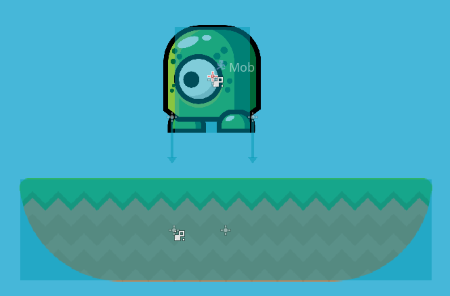

레이는 기본적으로 bodies 만 detect한다. RayCast2D 애 쓰이는 프로퍼티들은 다음과 같다

- Enabled : 레이캐스트가 동작하는지 안하는지. 디폴트는 disabled
- Exclude Parent : 부모 오브젝트와의 충돌은 무시하는지 여부. 디폴트는 Enable.
- Cast To : 레이가 날아가는 지점. local 좌표계를 사용한다.

## 유용한 함수들

- is_colliding() : 불리언 함수. 레이가 무엇과 충돌했는지 여부.
- get_collision_point() : 만약 레이가 충돌했다면, 해당 충돌체의 좌표를 반환함(global 좌표를 반환함)
- get_collider() : 레이가 부딪히면, 부딪힌 오브젝트의 레퍼런스를 반환함.
- get_collision_normal() : 아마 레이가 부딪힌 오브젝트의 부딪힌 지점의 법선(normal)을 반환하는 듯.

## 몇가지 예시

### 경계 감지

플랫포머 게임에서 플랫폼 위에서 배회하는 적을 생각해보자. 플랫폼의 끝단을 인식하고 움직여야지 안그러면 바닥으로 떨어질 것이다.

오브젝트 발 양쪽 끝에 바닥을 향하는 레이를 사용한다.



오브젝트 스크립트는 다음과 같다.

```
func _physics_process(delta):
    velocity.y += gravity * delta
    if not $RayRight.is_colliding():
        dir = -1
    if not $RayLeft.is_colliding():
        dir = 1
    velocity.x = dir * speed
    $AnimatedSprite.flip_h = velocity.x > 0
    velocity = move_and_slide(velocity, Vector2.UP)
```